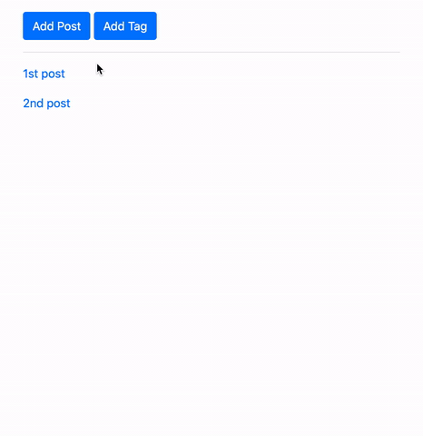

# Django_InlineFormSet_plus_ManyToMany_Field


[referred blog](https://narito.ninja/blog/detail/33/)



> ## models.py
``` python
from django.db import models
from django.utils import timezone

class Tag(models.Model):
    name = models.CharField('Tag Name', max_length=30)

    def __str__(self):
        return self.name

class Post(models.Model):
    title = models.CharField('Title', max_length=200)
    text = models.TextField('Content')
    date = models.DateTimeField('Date', default=timezone.now)
    tag = models.ManyToManyField(Tag, verbose_name='Tag', blank=True)

    def __str__(self):
        return self.title
```

> ## forms.py
``` python
from django import forms
from .models import Post, Tag


class PostCreateForm(forms.ModelForm):

    def __init__(self, *args, **kwargs):
        super().__init__(*args, **kwargs)
        for field in self.fields.values():
            field.widget.attrs['class'] = 'form-control'

    class Meta:
        model = Post
        exclude = ('tag',)

# We use inlineformset for tag. When we add new post, tags are listed by inlineformset
TagInlineFormSet = forms.inlineformset_factory(
    Post, Post.tag.through, fields='__all__', can_delete=False
)

# This is easy way of creating a simple form for tag.
TagCreateForm = forms.modelform_factory(Tag, fields='__all__')

# We also use inlineformset for posts. When we add new tag, posts are listed by inlineformset.
PostInlineFormSet = forms.inlineformset_factory(
    Tag, Post.tag.through, fields='__all__', can_delete=False
)
```


> ## views.py
``` python
from django.shortcuts import render, redirect, get_object_or_404
from django.views import generic
from .forms import PostCreateForm, TagInlineFormSet, TagCreateForm, PostInlineFormSet
from .models import Post

class PostList(generic.ListView):
    model = Post


def add_post(request):
    form = PostCreateForm(request.POST or None)
    context = {'form': form}
    if request.method == 'POST' and form.is_valid():
        post = form.save(commit=False)

        # We need to define which data is related to which, so we set instance=post here.        
        formset = TagInlineFormSet(request.POST, instance=post)
        if formset.is_valid():
            post.save()
            formset.save()
            return redirect('app:index')

        # we store formset with error message in context and it will be passed to template.
        else:
            context['formset'] = formset

    # GET, when we first go to 'add_post' url (add_post view), there is no data in context
    # so we set empty context below. By doing this, contents of formset can be displayed in post_list.html
    else:
        # passing empty formset to template
        context['formset'] = TagInlineFormSet()

    return render(request, 'app/post_form.html', context)


def update_post(request, pk):
    post = get_object_or_404(Post, pk=pk)
    form = PostCreateForm(request.POST or None, instance=post)
    formset = TagInlineFormSet(request.POST or None, instance=post)
    if request.method == 'POST' and form.is_valid() and formset.is_valid():
        form.save()
        formset.save()
        # show update page again here
        return redirect('app:update_post', pk=pk)

    context = {
        'form': form,
        'formset': formset
    }

    return render(request, 'app/post_form.html', context)


def add_tag(request):
    form = TagCreateForm(request.POST or None)
    context = {'form': form}
    if request.method == 'POST' and form.is_valid():
        tag = form.save(commit=False)

        # We need to define which data is related to which, so we set instance=tag here.
        formset = PostInlineFormSet(request.POST, instance=tag)
        if formset.is_valid():
            tag.save()
            formset.save()
            return redirect('app:index')

        # we store formset with error message in context and it will be passed to template.
        else:
            context['formset'] = formset

    # GET, when we first go to 'add_tag' url (add_tag view), there is no data in context
    # so we set empty context below. By doing this, contents of formset can be displayed in tag_form.html
    else:
        # passing empty formset to template
        context['formset'] = PostInlineFormSet()

    return render(request, 'app/tag_form.html', context)


def update_tag(request, pk):
    tag = get_object_or_404(Tag, pk=pk)
    form = TagCreateForm(request.POST or None, instance=tag)
    formset = PostInlineFormSet(request.POST or None, instance=tag)
    if request.method == 'POST' and form.is_valid() and formset.is_valid():
        form.save()
        formset.save()
        # show update page again here
        return redirect('app:update_tag', pk=pk)

    context = {
        'form': form,
        'formset': formset
    }

    return render(request, 'app/tag_form.html', context)
```

> ## urls.py
``` python

```

> ## admin.py
``` python

```

> ## post_form.html
``` python

```
